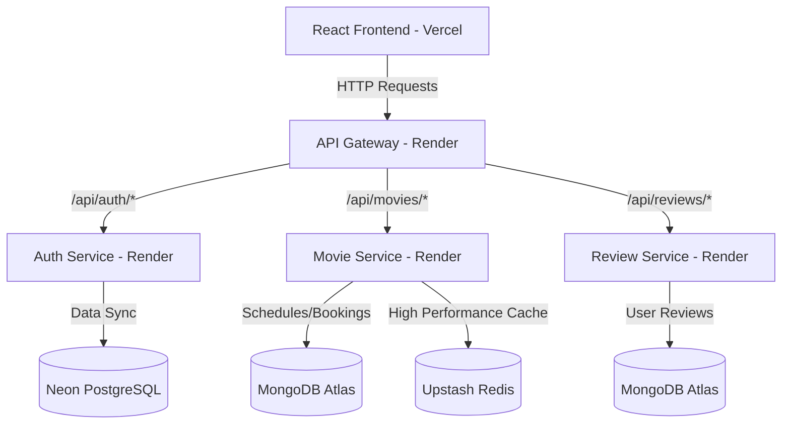

# Cineverse - Microservices Movie Booking & Review Platform

Cineverse is a modern, cloud-native Movie Booking and Review platform designed using a microservices architecture. It provides secure user authentication, movie scheduling, ticket booking, and real-time movie reviews, built with high scalability, fault tolerance, and performant caching.

## 🚀 Architecture Overview

Cineverse is split into a client-facing React application and four containerized backend microservices communicating via an API Gateway:



### 1. API Gateway (`gateway-service`)
* Acts as the single entry point for all client requests.
* Implements routing predicates, path rewrites, and CORS configurations.
* Integrates a JWT-based security filter to inspect tokens and inject user identity headers (`X-User-Email`, `X-User-Role`) down the stack.

### 2. Authentication Service (`auth-service`)
* Handles user registration, secure login, role management, and token validation.
* Database: **Neon Cloud PostgreSQL** (relational persistence for user accounts and roles).

### 3. Movie & Booking Service (`movie-service`)
* Manages movie listings, screen layouts, show timings, seat bookings, and schedule overlap prevention.
* Leverages Redis to cache active schedules and hot query results.
* Database: **MongoDB Atlas** (flexible document store for movies/bookings) & **Upstash Redis** (caching).

### 4. Review Service (`review-service`)
* Manages movie reviews and ratings submitted by users.
* Database: **MongoDB Atlas** (document store optimized for high write loads).

---

## 🛠️ Technology Stack

| Component | Technology | Description |
| :--- | :--- | :--- |
| **Frontend** | React, Vite, Axios | Responsive Single Page App (SPA) |
| **Backend** | Java 21, Spring Boot | Core Application Framework |
| **Routing** | Spring Cloud Gateway | API Routing & Token Interception |
| **Database (Relational)** | PostgreSQL (Neon Cloud) | User Credentials & Profile Management |
| **Database (NoSQL)** | MongoDB (Atlas) | Movies, Bookings, & Reviews |
| **Caching** | Redis (Upstash) | Cache-aside Pattern for Movie Schedules |
| **CI/CD** | GitHub Actions | Automatic builds, packaging, & test runs |
| **Deployment** | Docker, Render, Vercel | Production container hosting & client static hosting |

---

## ⚙️ Local Setup Guide

### Prerequisites
* Java 21 JDK
* Node.js (v18+)
* Docker & Docker Compose (optional, for localized containerized run)

### Running Services Separately
1. **Database & Caching**: Spin up local MongoDB, PostgreSQL, and Redis instances.
2. **Start Backend Services**:
   In each backend directory (`backend/auth-service`, `backend/movie-service`, `backend/review-service`, `backend/gateway-service`), run:
   ```bash
   ./mvnw spring-boot:run
   ```
3. **Start Frontend**:
   ```bash
   cd frontend
   npm install
   npm run dev
   ```

### Running with Docker Compose
To run the entire localized stack with one command:
```bash
docker-compose up --build
```

---

## 🔗 Production Deployment

* **Frontend**: Hosted on [Vercel](https://vercel.com/) at `https://cineverse-ebon-five.vercel.app/`
* **Backend Gateway**: Hosted on [Render](https://render.com/) at `https://cineverse-gateway.onrender.com`
* **Microservices**: Containerized using multi-stage Alpine JRE Docker builds and deployed on Render.

---

## 📦 CI/CD Pipeline

The project features a fully automated CI/CD pipeline built with **GitHub Actions** (`.github/workflows/ci-cd.yml`). On every push to the `main` branch, the workflow:
1. Spins up runner instances with containerized PostgreSQL, MongoDB, and Redis databases.
2. Installs Adoptium JDK 21.
3. Builds and packages each Java microservice using Maven.
4. Performs a production build of the Vite-based React application.
5. Confirms compiler and packaging integrity before allowing updates.
