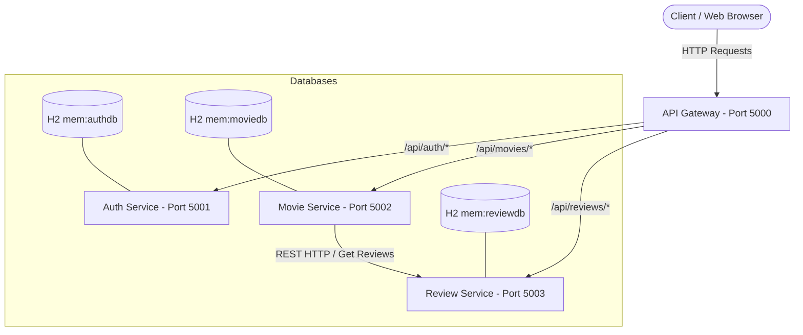
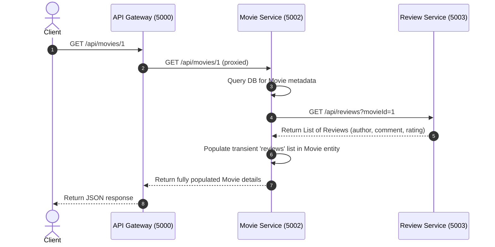

# Cineverse System Architecture

This document outlines the system architecture, component layout, and data flow of **Cineverse**, a modern movie booking and review platform modernized to use **Java 25** and **Spring Boot 4.1.0**.

---

## 1. System Overview

Cineverse is built on a microservices architecture. It decouples core business domains (Authentication/RBAC, Movie Metadata & Bookings, and Reviews) into distinct services, coordinated by an API Gateway.



---

## 2. Technology Stack

- **Frontend**: React.js, Vite, TailwindCSS (for modern responsive UI).
- **API Gateway**: Node.js & Express (using `http-proxy-middleware` for request routing).
- **Core Backend Framework**: Spring Boot 4.1.0 (built on Java 25).
- **Data Persistence**: Spring Data JPA & Hibernate 7.4.
- **Database**: H2 (In-memory, persistent per runtime instance).
- **Inter-service Communication**: Synchronous HTTP communication using Spring's `RestTemplate`.

---

## 3. Microservice Breakdown

### A. API Gateway (Port 5000)
- **Role**: Entry point for all external traffic.
- **Routing Rules**:
  - `/api/auth/**` $\rightarrow$ `http://localhost:5001`
  - `/api/movies/**` $\rightarrow$ `http://localhost:5002`
  - `/api/reviews/**` $\rightarrow$ `http://localhost:5003`

### B. Auth Service (Port 5001)
- **Role**: Manages user registration, role-based access control (RBAC), and session token validation.
- **Database**: H2 (`authdb`).
- **Entity**: `User` (Fields: `id`, `username`, `password`, `role`, `status`).
- **Supported Roles**: `Admin`, `User`, `Theatre Owner`.

### C. Movie Service (Port 5002)
- **Role**: Manages movie metadata, show schedules, and seat bookings.
- **Database**: H2 (`moviedb`).
- **Entities**:
  - `Movie` (Fields: `id`, `title`, `genre`, `year` (column `release_year`), `rating`, `image`, `overview`).
  - `Booking` (Fields: `id`, `username`, `movieTitle`, `seats`, `price`).
  - `ShowSchedule` (Fields: `id`, `movieId`, `movieTitle`, `showDate`, `showTime`, `blockedSeats`).
- **Inter-service Dependency**: Calls `Review Service` to fetch reviews when querying movie details.

### D. Review Service (Port 5003)
- **Role**: Manages movie ratings and written text reviews.
- **Database**: H2 (`reviewdb`).
- **Entity**: `Review` (Fields: `id`, `movieId`, `author`, `comment`, `rating`).

---

## 4. Layered Component Architecture

Each backend Spring Boot service enforces a strict 4-tier layered architecture for modularity and ease of unit-testing:

```
[ HTTP Request ] 
       │
       ▼
 1. Controller Layer  ── (Exposes REST endpoints, validates inputs, handles DTO mappings)
       │
       ▼
 2. Service Layer     ── (Executes business logic, performs inter-service calls)
       │
       ▼
 3. Repository Layer  ── (Declares database interfaces using Spring Data JPA)
       │
       ▼
 4. Entity Layer      ── (Maps Java Objects to Database Tables using Hibernate)
       │
       ▼
[ In-Memory H2 DB ]
```

---

## 5. Sequence Diagram: Fetching Movie Details with Reviews

When a client requests movie details, the Movie Service automatically fetches reviews from the Review Service.


